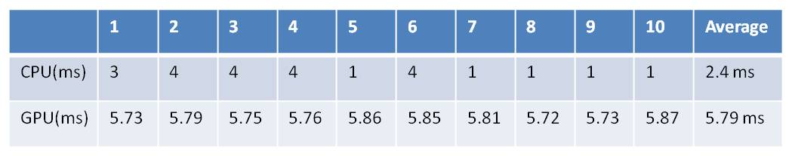

Question 1: 
Compare Serial Version Scan with Naive Parallel Scan No Share Memory

Array size: 100 {0,1,0,3,0,5,....,99,0}
iterate number: 1000 times

Question 2:
Compare Parallel Scan No Share Memory with Parallel Scan with Share Memory
Array size: 100 {0,1,0,3,0,5,....,99,0}
iterate number: 1000 times

Question 3:
Compare Parallel Scan No Share Memory with Parallel Scan with Share Memory
Array size: 50000 {0,1,0,3,0,5,....,49999,0}
iterate number: 100 times
