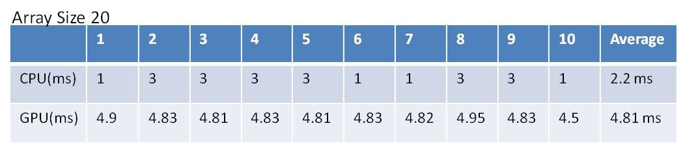

#Question 1: 
Compare Serial Version Scan with Naive Parallel Scan No Share Memory

iterate number: 1000 times

One problem here is that we use clock to gauge the time of CPU version, and the 
unit time is 1 millisecond.
On the other hand, we use cudaEvent to exam the execution time of GPU version, and the
unit time is microsecond.
The execution time of CPU is not stable.
Therefore, I am not sure if this two result could be compared directly. 

However, comparing with different array size I could say that the execution time of GPU version
is possitive correlative to the array size.  

From the table it looks like my GPU Naive parallel scan is slower than CPU serial scan.
(Although I doubt the CPU execution time.)
I guess that is because the GPU version the data is all get from global memory.
Besides, we don't provide any solution to avoid bank confliction.
Or, maybe it is jsut because my CPU is too fast(i7-4700)

#Question 2:
Compare Parallel Scan No Share Memory with Parallel Scan with Share Memory

Array size: 100 {0,1,0,3,0,5,....,99,0}
iterate number: 1000 times

From this table I would say that the share memory indeed provides some benefits,
although the effect is not remarkable.
For this version, I do not consider the bank confliction and I guess that is a big 
issue.

#Question 3:
Compare my version of Scan with Thrust Scan
Array size: 50000 {0,1,0,3,0,5,....,49999,0}
iterate number: 100 times

It looks like the scatter by using Thrust is much faster than my version.
That means I may need to implement the scatter by using only the share memory
and solve the bank confliction problem. Currently, because this function is for 
arbitrary array length, I have to access the global memory when doing the scan.

P.S. My program has a weird problem that the GPU scatter result will be wrong when I run my program the first time.
But when I stop the program and run the second time, it will generate the correct result.
I have no idea where is the problem.
